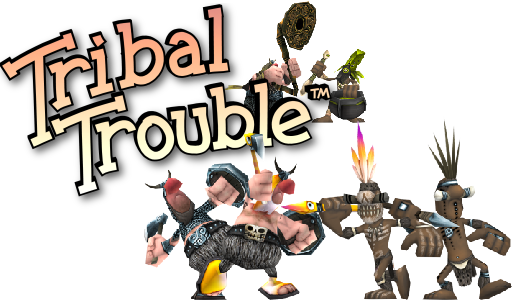
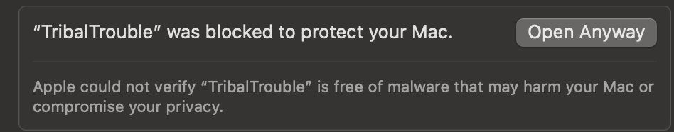

# Tribal Trouble

Tribal Trouble is a realtime strategy game released by Oddlabs in 2004. In 2014 the source was released under GPL2 license.

This fork aims to:

1. Bring the game back online and make it available for everyone to play as it was originally✅
2. Ensure it is easy to build and contribute to development of the game 🚧
3. Remaster and modernize the graphics 🚧
4. Add more playable features later 🚧

## Table of Contents

- [🎮 How to play?](#-how-to-play)
- [🛠️ Build Requirements](#-build-requirements)
- [🏗️ Building](#-building)
  - [Build + Run Game Client](#build--run-game-client)
  - [Build Game Client for Distribution](#build-game-client-for-distribution)
  - [Build + Run Game Server](#build--run-game-server)
- [🤝 Contributing](#-contributing)

## 🎮 How to play?

If you want to play the game with minimal hassle check out [Tribal Trouble](https://tribaltrouble.org) or see the releases section of the github. Also come join us on [discord](https://discord.gg/degeKcze) as we're still a small community!

The game is currently unsigned and not available through another platform like steam so when you launch the game different OSes will respond differently:

- Linux
  - Launch the `TribalTrouble-x86_64.AppImage`
- Windows
  - Launch the `TribalTrouble.exe`
  - A windows defender modal will pop up. Click more info > run anyway
- Mac
  - Launch the application
  - A modal appears warning the application is unsigned and should be moved to the trash. Click done
  - Go to system settings > Privacy & Security and click Open Anyway:
    

## 🛠️ Build Requirements

### Client + Server

- [Apache ant](https://ant.apache.org/)
- [Java SDK 24](https://www.oracle.com/java/technologies/downloads/) (or Open-JDK-24)

### Server

- [mySQL](https://dev.mysql.com/downloads/mysql/)

## 🏗️ Building

Instruction below assume you are in a terminal at the root of the repository

### Build + Run Game Client

- `cd tt` > `ant run`

### Build Game Client for Distribution

Building the game client Distribution files can be found in `tt/builds/dist/common`

- Linux
  - `cd tt` > `ant build-linux`
- Windows
  - `cd tt` > `ant build-windows`
- Mac x86
  - `cd tt` > `ant build-mac-x86`
- Mac arm64
  - `cd tt` > `ant build-mac-arm64`

Optional Steps (Recommend for server hosting)

1. Key generation - before building the client or the server keys must be generated.
    - Inside a terminal > `cd tools`
    - `ant run generatekeys`
    - Enter a password when it asks for one
    - Make sure the keys are generated under `./common/static/`.

    > Why is key generation optional? The keys it generates are commited to the repository. If you intend to run a server you may want generate your own keys since they are used for encryption/decryption with the client and server

### Build + Run Game Server

1. mySQL Setup
    - Create the database schema from `initmysql.sql`.
    - Create the user `matchmaker` with any password you  would like (remember it for the next step)
    - Add the same password from the above step password as an environment variable use the name `TT_SERVER_PASSWORD`

    > Make sure to restart any terminals you have open

2. Revision number:
     - The game client automatically detects the revision number using a git command when it's built
     - The server should set a minimum revision number for what clients can use it.
     - That number goes as an entry in the database.
     - The revision number of a certain git commit is retrieved using `git rev-list --count HEAD`
     - Store that number in the `settings` table using the following query: `UPDATE settings SET value = REVISION_NUMBER WHERE property = 'revision';`
3. Run the servers
     - There are two main servers needed. The matchmaker and the router. The matchmaker is what runs the game and most the server logic. The router sends and recieves chat messages and other messages from the client
     - To build and run the matchmaker: `cd server` > `ant run-matchmaker`
     - To build and run the router: `cd server` > `ant run-router`
     - Alternatively run the scripts from the server using: `cd server` > `./matchmaker & ./router`

     > Note: The router and matchmaker can be hosted on the same or a different machine. The only time they actually need to be on the same machine is when one logs a crashing event to the database

## 🤝 Contributing

Thanks for your interest in contributing. We have a channel in [discord](https://discord.gg/degeKcze) that is active with contributors if you have any questions on setup or where to find things. Come chat, play some games!

See something you want or could improve upon? Make a PR or an issue! Don't have an idea? There's plenty of work to be done check out the active issues!

There are ways to contribute besides developing. If you have screenshots of the game from back in the day those are welcome.

> For example a screenshot of the old the leaderboards.

Being an active member in the [discord](https://discord.gg/degeKcze) and playing games also will help keep the game going!
